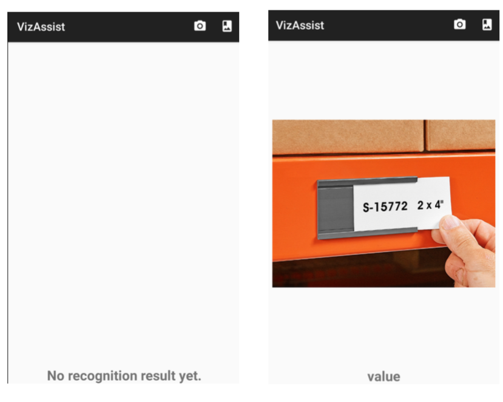

# vizassist
### What is this application
An android app that assists blind people in text reading

### The purpose
To increase accessibility.
* Blind people are facing many visual challenges everyday, includes:
    * Identification
    * Description
    * Reading
    * Other
    

## How it work (client-side)

* **First page**
    * Camera capture button
    * Image gallery button (upload from local)
    * Test and image placeholder

* **Result page**
    * Image captured or selected
    * Result and error message

* **What happen in between**
    * Image data accessing and packaging
    * OCR server query with image data
    * UI update with server query result

## How it work (server-side)
* Utilize an **IaaS** service model in Google Cloud Engine
* build an docker container with tomcat image to run our server-side application in GCE Virtual Machine

